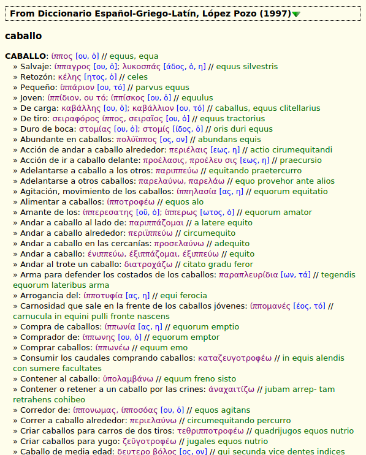

# {{ page.title }}, {{ page.author }} ({{ page.year }})

This trilingual dictionary provides translations of the words from Spanish to Greek and Latin languages with reach examples.

Website of the author, Francisco López Pozo, does not functioning now (see [Internet Archive][4]). Copy of the dictionary can be found in the author's old blog ["Córdoba de Altas Torres"][5] or on the web-portal [Cultura Clásica][6], but they all are separated into chapters. Complete book is shared on several websites, such as [1][7] or [2][8]. All versions are equal.

In 2007 year, author announced second edition of the dictionary, hovewever to the best of our knowledge it never was published.

## Download

Current draft version is [v0.1 (October 25, 2019)][1]. Format Slob is recommended for GoldenDict, read [documentation][2] about other dictionary shells.

Source files are in the [github repository][3].

## Exemplum

  

# Sources

1. López Pozo, F. _Diccionario Español-Griego-Latín._ 1997(?). URL: <http://www.culturaclasica.com/?q=diccionario>.

# States and limitations

Content of the dictionary was converted from DPF, proofreading is needed.

## License

[1]: https://github.com/nikita-moor/latin-dictionary/releases/tag/2019-10-25
[2]: {{ site.baseurl }}
[3]: https://github.com/nikita-moor/latin-dictionary/tree/master/{{ page.nickname }}
[4]: http://web.archive.org/web/20170311085837/http://www.cordobadealtastorres.com:80/
[5]: http://cordobadealtastorres1.blogspot.com/2009/07/diccionarios.html
[6]: http://www.culturaclasica.com/?q=diccionario
[7]: https://dokumen.tips/documents/diccionario-espanol-griego-latin.html
[8]: https://www.scribd.com/document/333448184/Diccionario-Espanol-Griego-Latin-Francisco-Lopez-Pozo

