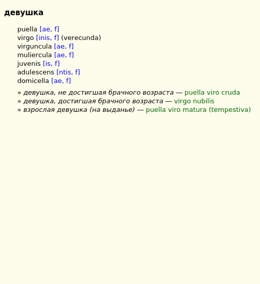

# {{ page.title }}, {{ page.author }} ({{ page.year }})

Latin: Vocabularium Russico-Latinum Magnum.

Russian-Latin dictionary containing Contemporary Latin lexis was compiled by Poliachev M. P. (Поляшев Михаил Петрович, 1951-2005).


## Download

Current version is [v1.0 (November 5, 2019)][1]. Format Slob is recommended for GoldenDict, read [documentation][2] about other dictionary shells. Files in ABBYY Lingvo (DSL) and Pop-Up Dictionary formats can be taken from [Lingua Latina Aeterna][4].

Source files are in the [github repository][3].


## Exemplum

<!--
<div class="spotlight-group" data-animation="" data-control="" data-autohide="false">
  
  
</div>
-->





# Sources

1. Поляшев М. П. _Большой русско-латинский словарь._ 2002(?). URL: <http://linguaeterna.com/ru/lexi.php> [Accessed 2019-11-06].


# States and limitations

Articles with sub-definitions were augmented with short notes, such as:

```
адрес
1. местонахождения
[...]
2. письменное поздравление
[...]
```

The resting part of the content was left intact, not counting formatting corrections.


# Errata

* валун: "по валам" &gt; "по валунам"
* житель: "incola, ae, n" &gt; "incola, ae, m"
* играть: "играть на музыкальном инструменте" &gt; "играть на музыкальном инструменте canĕre; trāctāre"
* ни: "пес... пес..." &gt; "nec... nec..."
* ниже: "sequenttbus" &gt; "sequentibus"
* пост: "jeunium" &gt; "jejunium"
* средний: "equites um" (removed)


## License

<a rel="license" href="http://creativecommons.org/publicdomain/mark/1.0/">

</a>

This work is distributed as <a rel="license" href="http://creativecommons.org/publicdomain/mark/1.0/">Public Domain</a> with approval of Yuriy Semenov (Юрий Семёнов), the current administrator of Lingua Latina Aeterna.


[1]: https://github.com/nikita-moor/latin-dictionary/releases/tag/2019-11-05
[2]: {{ site.baseurl }}
[3]: https://github.com/nikita-moor/latin-dictionary/tree/master/{{ page.nickname }}
[4]: http://linguaeterna.com/ru/down.php

